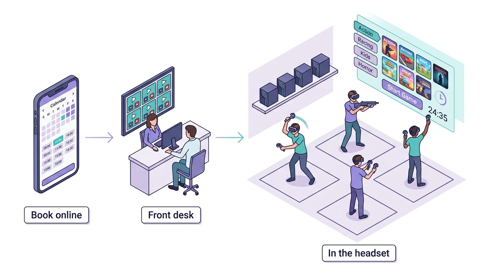
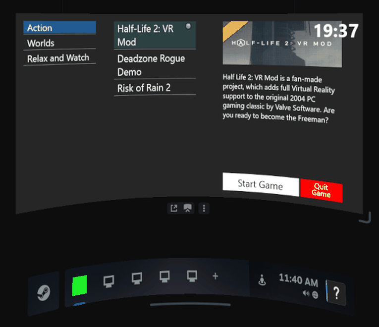
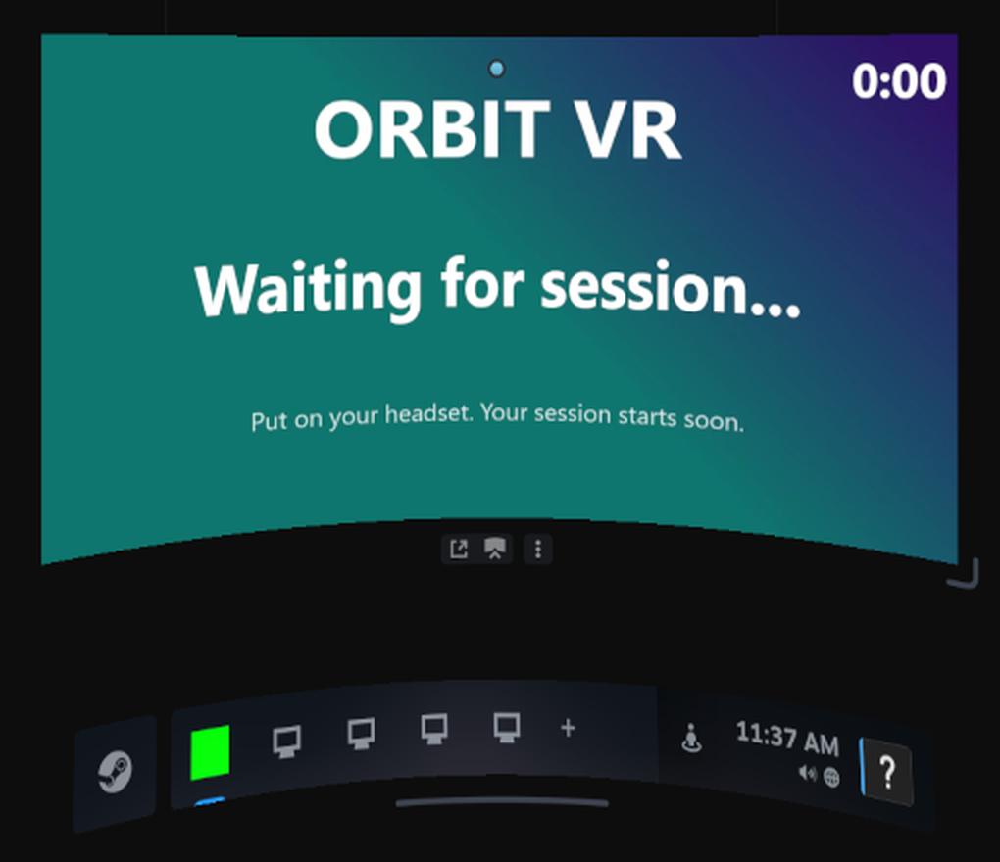

# OpenArcade

**The free, open-source way to run a VR arcade.** A game menu and session timer inside every
headset, a front desk app to start and stop sessions, and online booking with payments. You run
it on your own PCs and web host, and there is no monthly platform fee.

Arcades usually pay a commercial platform every month for exactly this: the in-headset launcher
that lets guests pick their own games and watch their time, plus the front desk control that
starts and ends every session. OpenArcade is that software, opened up, with AI agents doing the
setup from copy-paste prompts.

### Why this exists

My wife and I ran VR Lawrence, a seven-station VR arcade, for four years. The platforms that run
arcades charge every month, and for a small venue those fees were simply too high.
So I built our own system: the headset menu and timer, the front desk controller, and the booking
site. It ran the arcade until we closed it. I cleaned it up and am giving it away so the next small
arcade can spend that money on headsets and games instead. *(Prabh Arora)*



<sub>Illustration of how the parts fit together, not a screenshot.</sub>

> **Early release.** This is a working head start, not a finished product. The booking system has
> 142 automated tests, and its money paths (holds, idempotent charges, refunds, reconciliation) are
> tested. The station app has been run end to end against SteamVR's
> virtual headset (the screenshots below), but not on a physical headset since this cleanup, and the
> booking system has not yet been run against live Square and SMTP accounts. Try everything on a test
> setup and with Square's sandbox before real customers. See [Known limitations](#known-limitations).

## What guests get in the headset

The station app runs on every gaming PC and adds your arcade's own tab to the SteamVR dashboard.

| During a session: game menu and countdown | Between sessions: your branded waiting screen |
| --- | --- |
|  |  |

<sub>Real captures of the station app inside SteamVR (virtual headset). "Orbit VR" is a demo venue; the
menu lists whatever games are installed on the PC.</sub>

- **A game menu of your own.** Your games, sorted into categories you choose (Action, Kids, Horror,
  Racing and so on). Selecting one shows its cover art and description.
- **They pick, it launches.** Guests press **Start Game** and the game opens: Steam titles through
  SteamVR, and any other game or experience through its own program. **Quit Game** takes them back
  to the menu so they can try something else, without calling staff.
- **Time left, always one button away.** The countdown sits at the top of the menu. Guests press
  the controller's menu button at any point, even mid-game, to check it.
- **Time's up is automatic.** When the countdown ends, the station closes the game and puts the
  headset back on your branded waiting screen, with a looping video of your logo, ready for the next
  group. It also tells the front desk that the station is free.
- **Little setup per game.** Installed Steam games are found by themselves, with their store art and
  descriptions downloaded and cached. Non-Steam games are added once in the app window.

## What staff get

- **Master controller** on the front desk PC: every station in one window. Start a session with the
  minutes booked, add time, or stop it, for one headset or a whole group at once. Stations connect
  over the venue's local network and reconnect by themselves.
- **Staff dashboard** in the browser (`/admin/`): the day's bookings on a timeline with one lane per
  station, walk-ins, reschedules, cancellations, and all venue settings.
- **Game library export**: one button turns your catalog into a web page for your website.

## What customers get online

- **Booking page** (`/book/`) that works on phones and can be embedded in your existing website:
  date, session length, number of headsets, live availability, contact details, optional card
  payment through Square, and a confirmation email with a code.
- **No double bookings**, even when several people book the last free headset at the same moment.

## The three parts

| Part | Runs on | What it does |
| --- | --- | --- |
| Station app ([`station/`](station/README.md)) | Every gaming PC | The in-headset game menu, countdown and launcher; ends sessions at time up |
| Master controller ([`master-controller/`](master-controller/README.md)) | Front desk Windows PC | Start, add time and stop sessions for one station or a group |
| Booking system (this folder, PHP) | Any web host, or Docker | Online booking, payments, email, staff dashboard |

The station apps and the master controller talk only over your local network
([`docs/in-venue.md`](docs/in-venue.md)). No cloud service sits between your front desk and your
headsets. Staff start each session at the front desk, just as on the commercial platforms.

## Set it up with an AI agent

Paste this into Codex, Claude Code, Cursor or any coding agent that can reach your server or
hosting account:

```
Install OpenArcade from https://github.com/aprabh96/openarcade. Start by reading AGENTS.md
and docs/agent-prompts/README.md, pick the prompt that matches my setup (<Docker on a server / shared web hosting>),
ask me only for what the prompt lists, and finish with "php bin/console doctor" passing.
```

For the gaming PCs and the front desk PC, use
[`docs/agent-prompts/set-up-stations.md`](docs/agent-prompts/set-up-stations.md). More prompts,
for Square, embedding the booking page, going live and upgrading, are in
[`docs/agent-prompts/`](docs/agent-prompts/README.md). Doing it by hand? See
[`docs/deploy-docker.md`](docs/deploy-docker.md), [`docs/deploy-shared-hosting.md`](docs/deploy-shared-hosting.md)
and the READMEs in [`station/`](station/README.md) and [`master-controller/`](master-controller/README.md).

## Screenshots

| Customer booking page | Staff dashboard |
| --- | --- |
|  |  |
|  |  |

More in [`docs/screenshots/`](docs/screenshots/), including the phone layout and settings. All names
are demo data.

## More details

- **Payments** (optional): Square card payments in the browser, charged with a server-side amount
  under an idempotency key, with holds that expire, refunds when a slot is lost, and automatic
  reconciliation when a payment response never arrives.
- **Email**: confirmations to the customer and the venue through SMTP or PHP `mail()`.
- **Operations**: `php bin/console doctor --online` checks the whole booking installation and exits
  non-zero until every problem is fixed.

## Requirements

Booking system: PHP 8.1 or newer (`pdo_mysql`, `curl`, `mbstring`, `openssl`), MySQL 5.7+ or
MariaDB 10.4+, and either Docker or an Apache host with `mod_rewrite`. No framework, no Node, no build
step, one Composer dependency (PHPMailer). It runs on a $5 shared hosting plan.

In the venue: Windows 10 or 11 on the front desk PC and on each gaming PC, SteamVR on the gaming PCs,
and Visual Studio 2022 (or its free Build Tools) to compile the two apps.

## Quick start (Docker)

```bash
cp .env.example .env                       # set APP_URL, APP_KEY, DB_PASSWORD (required)
docker compose build && docker compose run --rm app composer install --no-dev --optimize-autoloader
docker compose up -d
docker compose run --rm -e OPENARCADE_ADMIN_PASSWORD='a-long-password' app \
  php bin/console install --admin-user=owner --venue="Orbit VR" --timezone=America/Chicago --stations=7
docker compose run --rm app php bin/console doctor
```

Then open `http://localhost:8088/book/` and `http://localhost:8088/admin/`.

## Configuration

Secrets and environment facts live in `.env` (see [`.env.example`](.env.example)): the database,
`APP_KEY`, `APP_URL`, `PAYMENT_MODE` (`none` or `square`) and Square keys, `MAIL_DRIVER` (`log`, `mail`, `smtp`) and SMTP details,
`EMBED_ALLOWED_ORIGINS`, `TRUST_PROXY`. Everything about the venue lives in the dashboard: name,
timezone, currency, tax, stations, hours, prices, buffer, lead time, branding.

Two cron jobs keep it tidy: `php bin/console holds:release` every 5 minutes (releases unpaid
holds and reconciles late payments) and `php bin/console privacy:purge --older-than-months=12`
monthly (anonymises old guest details).

## Console

| Command | Purpose |
| --- | --- |
| `install --admin-user= [--venue= --timezone= --stations=]` | Migrate, seed defaults, create the first admin (password via `OPENARCADE_ADMIN_PASSWORD` or a hidden prompt) |
| `migrate` | Apply new database migrations after an upgrade |
| `admin:create --admin-user=` | Add another staff account |
| `admin:unlock --admin-user=` | Clear failed sign-in attempts for a username |
| `doctor [--online] [--json]` | Check PHP, configuration, database, payments, mail and web exposure |
| `holds:release` | Cron: expire unpaid holds, reconcile late Square payments |
| `privacy:purge --older-than-months=N` | Cron: anonymise past reservations |
| `seed:demo` | Fake reservations for screenshots and demos (refuses on a database with real bookings) |

## Development

```bash
docker compose build && docker compose run --rm app composer install
docker compose run --rm app composer check     # style, PHPStan level 6, 142 tests, secret scan, dependency audit
msbuild station/StationApp.sln -p:Configuration=Release -p:Platform=x64
msbuild master-controller/MasterController.sln -p:Configuration=Release -p:Platform=x64
```

Tests run against a real MariaDB: unit, integration and in-process API suites. The clean-repo gate
(`bin/check-clean`) refuses commits that contain API keys, real email addresses or phone numbers;
test data uses `@example.com` and `555-01xx` only. Architecture and the booking guarantee are
described in [`docs/architecture.md`](docs/architecture.md), the API in [`docs/api.md`](docs/api.md).
Contributor rules for people and agents are in [`AGENTS.md`](AGENTS.md).

## Known limitations

- One venue per install, one admin role (every staff account can do everything).
- Refunds for a changed booking are done in the Square dashboard; the dashboard does not issue them.
- The staff dashboard uses the browser's clock for "today", so it should run in the venue's timezone.
- Live Square and SMTP integrations are covered by tests against fakes only so far.
- The booking system and the in-venue session control (master controller and station apps) are
  separate: staff start each session at the front desk, as with the commercial platforms.
- The countdown lives in the in-headset menu (a SteamVR dashboard tab); it does not float over the
  game while guests play.
- The front desk to station protocol has no password; keep it on the venue's private network
  ([`docs/in-venue.md`](docs/in-venue.md#security)).
- The Windows apps are the code that ran the arcade, renamed and cleaned up. The station app has been
  run against SteamVR's virtual headset, not yet on a physical headset since the cleanup. Reports from
  the first venues are very welcome.
- The front desk port is fixed at 12345. If another program on the front desk PC already uses it,
  stations cannot connect ([`docs/in-venue.md`](docs/in-venue.md#protocol)).

Issues and pull requests are welcome; see `AGENTS.md` for the rules the tests enforce.

## Security

See [`SECURITY.md`](SECURITY.md). Card numbers never touch this server; passwords are hashed;
every query is prepared; admin writes need CSRF tokens; public bookings need a signed booking
token and a same-origin request; a Content Security Policy limits scripts to the site and Square.

## License

Copyright (c) 2021-2026 Prabhsimran Arora and Sheyenne Fishero.

OpenArcade is free software under the [GNU Affero General Public License v3.0](LICENSE) or later.
In plain terms: any arcade or business may use it, change it and run its venue on it, commercially
and for free. Anyone who distributes it, or offers it to others as a hosted service, must publish
their complete source code, changes included, under the same license.

**Commercial licenses** are available for companies that want to build a closed-source product on
OpenArcade: prabh@psynect.ai.

Third-party components keep their own licenses; see [`THIRD-PARTY-NOTICES.md`](THIRD-PARTY-NOTICES.md).
