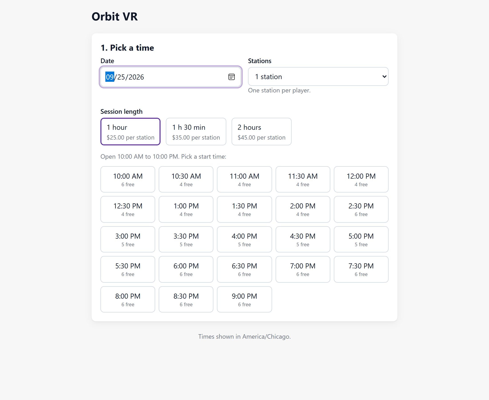
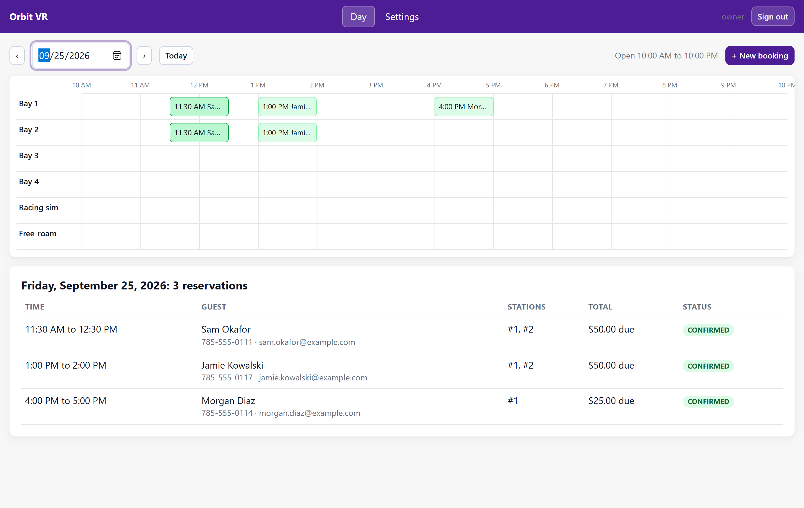
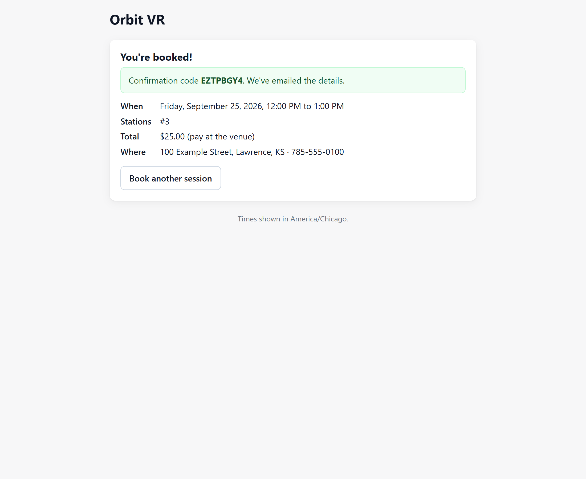
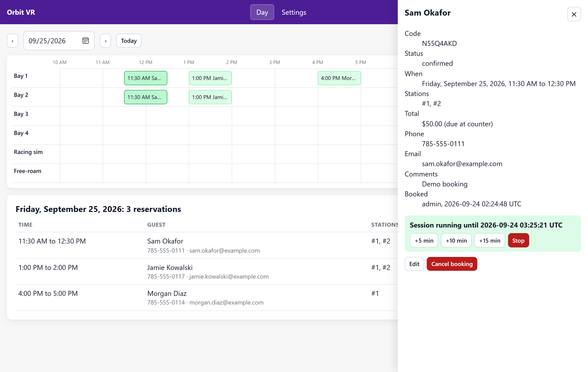

# VR Arcade OS (working name)

> **Early release.** This is a working head start, not a finished product. It ran a real arcade, it
> has 147 automated tests, and the money paths (holds, idempotent charges, refunds, reconciliation)
> are tested. It has not yet been run against live Square and SMTP accounts in this
> form, and the Docker image is untested outside CI. Test with Square's sandbox before taking real
> payments. Known gaps are listed under [Known limitations](#known-limitations).

An open-source operating system for VR arcades: online booking, a staff dashboard, and in-headset
session control with a game launcher. Until now that last part meant paying a commercial arcade
platform every month. This is the software that ran the VR Lawrence arcade for four years, cleaned
up so any venue can run it, with AI agents doing the setup from copy-paste prompts.

| Part | Runs on | What it does |
| --- | --- | --- |
| Booking system (`/`, PHP) | Any web host or Docker | Online booking with live availability, optional Square payments, email confirmations, staff dashboard |
| Master controller (`master-controller/`) | Front desk Windows PC | Start, add time and stop sessions on one station or a group |
| Station app (`station/`) | Each gaming PC | Countdown and game menu inside the headset (SteamVR overlay), launches Steam and custom games, ends the session when time is up |

The two Windows apps talk over the venue's local network; see [`docs/in-venue.md`](docs/in-venue.md).
Sessions are started by staff at the front desk, as on the commercial platforms.

**Install it with your AI agent.** Paste this into Codex, Claude Code, Cursor or any coding agent
that can reach your server or hosting account:

```
Install the VR arcade booking system from https://github.com/<owner>/<repo>. Start by reading AGENTS.md
and docs/agent-prompts/README.md, pick the prompt that matches my setup (<Docker on a server / shared web hosting>),
ask me only for what the prompt lists, and finish with "php bin/console doctor" passing.
```

More prompts, for connecting Square, embedding on a website, going live and upgrading, are in
[`docs/agent-prompts/`](docs/agent-prompts/README.md). Prefer doing it by hand? See
[`docs/deploy-docker.md`](docs/deploy-docker.md) and [`docs/deploy-shared-hosting.md`](docs/deploy-shared-hosting.md).

## Screenshots

| Customer booking page | Staff dashboard |
| --- | --- |
|  |  |
|  |  |

More in [`docs/screenshots/`](docs/screenshots/), including the phone layout and settings. All names are demo data.

## What you get

- **Booking page** (`/book/`): date, session length, number of stations, live availability,
  contact details, optional card payment, confirmation with a code and an email. Embeddable on
  any website.
- **Staff dashboard** (`/admin/`): a day timeline with one lane per station, walk-ins, reschedule,
  cancel, and settings for hours, prices,
  closures, special hours, stations and branding.
- **No double bookings.** The server decides availability and picks the stations inside a locked
  transaction; a multi-process test proves that eight simultaneous customers get exactly one
  booking for the last free station. Buffers between sessions, opening hours, lead time, advance
  limit and slot grid are all enforced on the server.
- **Payments** (optional): Square card payments in the browser, charged with a server-side amount
  under an idempotency key, with holds that expire, refunds when a slot is lost, and automatic
  reconciliation when a payment response never arrives.
- **Email**: confirmations to the customer and the venue through SMTP or PHP `mail()`.
- **In the headset** (Windows): a session countdown, a game menu with categories, one-click launch
  of Steam and non-Steam games, automatic end of the session, and a front desk app to run every
  station. See [`station/`](station/README.md) and [`master-controller/`](master-controller/README.md).
- **Operations**: `php bin/console doctor --online` checks the whole installation the way a
  careful engineer would, and exits non-zero until every problem is fixed.

## Requirements

PHP 8.1 or newer (`pdo_mysql`, `curl`, `mbstring`, `openssl`), MySQL 5.7+ or MariaDB 10.4+, and
either Docker or an Apache host with `mod_rewrite`. That is the whole stack: no framework, no
Node, no build step, one Composer dependency (PHPMailer). It runs on a $5 shared hosting plan.

## Quick start (Docker)

```bash
cp .env.example .env                       # set APP_URL, APP_KEY, DB_PASSWORD (required)
docker compose build && docker compose run --rm app composer install --no-dev --optimize-autoloader
docker compose up -d
docker compose run --rm -e ARCADEOS_ADMIN_PASSWORD='a-long-password' app \
  php bin/console install --admin-user=owner --venue="Orbit VR" --timezone=America/Chicago --stations=7
docker compose run --rm app php bin/console doctor
```

Then open `http://localhost:8088/book/` and `http://localhost:8088/admin/`.

## Configuration

Secrets and environment facts live in `.env` (see [`.env.example`](.env.example)): the database,
`APP_KEY`, `APP_URL`, `PAYMENT_MODE` (`none` or `square`) and Square keys, `MAIL_DRIVER` (`log`, `mail`, `smtp`) and SMTP details,
`EMBED_ALLOWED_ORIGINS`, `TRUST_PROXY`. Everything about the venue lives in the dashboard: name,
timezone, currency, tax, stations, hours, prices, buffer, lead time, branding.

Two cron jobs keep it tidy: `php bin/console holds:release` every 5 minutes (releases unpaid
holds and reconciles late payments) and `php bin/console privacy:purge --older-than-months=12`
monthly (anonymises old guest details).

## Console

| Command | Purpose |
| --- | --- |
| `install --admin-user= [--venue= --timezone= --stations=]` | Migrate, seed defaults, create the first admin (password via `ARCADEOS_ADMIN_PASSWORD` or a hidden prompt) |
| `migrate` | Apply new database migrations after an upgrade |
| `admin:create --admin-user=` | Add another staff account |
| `admin:unlock --admin-user=` | Clear failed sign-in attempts for a username |
| `doctor [--online] [--json]` | Check PHP, configuration, database, payments, mail and web exposure |
| `holds:release` | Cron: expire unpaid holds, reconcile late Square payments |
| `privacy:purge --older-than-months=N` | Cron: anonymise past reservations |
| `seed:demo` | Fake reservations for screenshots and demos (refuses on a database with real bookings) |

## Development

```bash
docker compose build && docker compose run --rm app composer install
docker compose run --rm app composer check     # style, PHPStan level 6, 147 tests, secret scan, dependency audit
```

Tests run against a real MariaDB: unit, integration and in-process API suites. The clean-repo gate
(`bin/check-clean`) refuses commits that contain API keys, real email addresses or phone numbers;
test data uses `@example.com` and `555-01xx` only. Architecture and the booking guarantee are
described in [`docs/architecture.md`](docs/architecture.md), the API in [`docs/api.md`](docs/api.md).
Contributor rules for people and agents are in [`AGENTS.md`](AGENTS.md).

## Known limitations

- One venue per install, one admin role (every staff account can do everything).
- Refunds for a changed booking are done in the Square dashboard; the dashboard does not issue them.
- The staff dashboard uses the browser's clock for "today", so it should run in the venue's timezone.
- Live Square and SMTP integrations are covered by tests against fakes only so far.
- The booking system and the in-venue session control (master controller and station apps) are
  separate: staff start each session at the front desk, as with the commercial platforms.

Issues and pull requests are welcome; see `AGENTS.md` for the rules the tests enforce.

## Security

See [`SECURITY.md`](SECURITY.md). Card numbers never touch this server; passwords are hashed;
every query is prepared; admin writes need CSRF tokens; public bookings need a signed session
token and a same-origin request; a Content Security Policy limits scripts to the site and Square.

## License

MIT. Third-party components are listed in [`THIRD-PARTY-NOTICES.md`](THIRD-PARTY-NOTICES.md).
